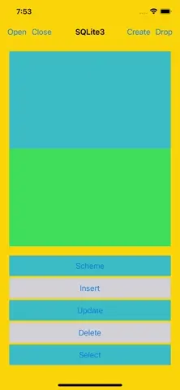

# WWSQLite3Manager

[](https://developer.apple.com/swift/) [](https://developer.apple.com/swift/)  [](https://developer.apple.com/swift/) [](https://developer.apple.com/swift/)

### [Introduction - 簡介](https://swiftpackageindex.com/William-Weng)
- A small tool for SQLite3 that makes basic [CRUD](https://zh.wikipedia.org/zh-tw/增刪查改) easier to use.
- 一個SQLite3的小工具，讓基本的[CRUD](https://zh.wikipedia.org/zh-tw/增刪查改)能更方便的使用.



### [Installation with Swift Package Manager](https://medium.com/彼得潘的-swift-ios-app-開發問題解答集/使用-spm-安裝第三方套件-xcode-11-新功能-2c4ffcf85b4b)
```
dependencies: [
    .package(url: "https://github.com/William-Weng/WWSQLite3Manager.git", .upToNextMajor(from: "1.5.2"))
]
```

### [Function - 可用函式](https://ezgif.com/video-to-webp)
|函式|功能|
|-|-|
|connect(fileURL:)|建立SQLite連線|
|connect(for:filename:)|建立SQLite連線|
|execute(sql:)|直讀SQL|
|prepare(sql:)|執行SQL語句|
|select(sql:result:completion:)|執行SELECT SQL|
|close()|關閉SQLite連線|
|tableScheme(tableName:)|取得該Table的結構組成|
|create(tableName:type:primaryKeys:isOverwrite:)|建立Table|
|drop(tableName:isOverwrite:)|刪除Table|
|transaction(type:)|事務處理|
|insert(tableName:itemsArray:)|插入資料|
|update(tableName:items:where:)|更新資料|
|delete(tableName:where:)|刪除資料|
|select(tableName:type:where:groupBy:having:orderBy:limit:)|查詢資訊|
|select(tableName:functions:type:where:groupBy:having:orderBy:limit:)|搜尋資料|

### Example
```swift
import Foundation
import WWSQLite3Manager

final class Student: Codable {
    
    let id: Int
    let name: String
    let height: Double
    let image: Data?
    let time: Date?
}

extension Student: SQLite3SchemeDelegate {
    
    static func structure() -> [(key: String, type: SQLite3Condition.DataType)] {
        
        let keyTypes: [(key: String, type: SQLite3Condition.DataType)] = [
            (key: "id", type: .INTEGER()),
            (key: "name", type: .TEXT(attribute: (isNotNull: true, isNoCase: true, isUnique: true), defaultValue: nil)),
            (key: "height", type: .REAL()),
            (key: "image", type: .BLOB()),
            (key: "time", type: .TIMESTAMP()),
        ]
        
        return keyTypes
    }
}
```
```swift
import UIKit
import WWSQLite3Manager

final class ViewController: UIViewController {
    
    @IBOutlet weak var sqlTextView: UITextView!
    @IBOutlet weak var resultTextView: UITextView!
    
    private let databaseName = "sqlite3.db"
    private let tableName = "students"
    
    private var database: SQLite3Database?
    
    override func viewDidLoad() {
        super.viewDidLoad()
    }
    
    @IBAction func connentDatabase(_ sender: UIBarButtonItem) {
        
        let result = WWSQLite3Manager.shared.connect(for: .documents, filename: databaseName)
        
        switch result {
        case .failure(let error):
            displayText(sql: nil, result: error)
        case .success(let database):
            self.database = database
            displayText(sql: nil, result: database.fileURL)
        }
    }
    
    @IBAction func closeDatabase(_ sender: UIBarButtonItem) {
        
        guard let database = database,
              database.close()
        else {
            displayText(sql: nil, result: "Database Close Fail."); return
        }
        
        displayText(sql: nil, result: "Database Close Success.")
    }
    
    @IBAction func dropTable(_ sender: UIBarButtonItem) {
        
        guard let database = database else { displayText(sql: nil, result: "Database Drop Fail."); return }
        
        let result = database.drop(tableName: tableName)
        displayText(sql: result.sql, result: result.isSussess)
    }
    
    @IBAction func createTable(_ sender: UIBarButtonItem) {
        
        guard let database = database else { displayText(sql: nil, result: "Database Create Fail."); return }
        
        let result = database.create(tableName: tableName, type: Student.self, isOverwrite: false)
        displayText(sql: result.sql, result: result.isSussess)
    }
    
    @IBAction func insertData(_ sender: UIButton) {
        
        guard let database = database,
              let itemsArray = Optional.some((1...5).map { _ in randomItems() }),
              let result = database.insert(tableName: tableName, itemsArray: itemsArray)
        else {
            displayText(sql: nil, result: "Database Insert Fail."); return
        }
        
        displayText(sql: result.sql, result: result.isSussess)
    }
    
    @IBAction func tableScheme(_ sender: UIButton) {
        
        guard let database = database else { displayText(sql: nil, result: "Database Scheme Fail."); return }
        
        let result = database.tableScheme(tableName: tableName)
        displayText(sql: result.sql, result: result.array)
    }
    
    @IBAction func updateData(_ sender: UIButton) {
        
        guard let database = database else { displayText(sql: nil, result: "Database Update Fail."); return }
        
        let condition = SQLite3Condition.Where().isCompare(type: .equal(key: "id", value: "1"))
        let result = database.update(tableName: tableName, items: randomItems(), where: condition)
        
        displayText(sql: result.sql, result: result.isSussess)
    }
    
    @IBAction func deleteData(_ sender: UIButton) {
        
        guard let database = database else { displayText(sql: nil, result: "Database Insert Fail."); return }
        
        let condition = SQLite3Condition.Where().isCompare(type: .equal(key: "id", value: "1"))
        let result = database.delete(tableName: tableName, where: condition)
        
        displayText(sql: result.sql, result: result.isSussess)
    }
    
    @IBAction func selectData(_ sender: UIButton) {
        
        guard let database = database else { displayText(sql: nil, result: "Database Select Fail."); return }
        
        let condition = SQLite3Condition.Where().like(key: "name", condition: "William%").andCompare(type: .greaterOrEqual(key: "height", value: 165))
        let orderBy = SQLite3Condition.OrderBy().item(type: .ascending(key: "height")).addItem(type: .descending(key: "time"))
        let limit = SQLite3Condition.Limit().build(count: 3, offset: 5)
        let result = database.select(tableName: tableName, type: Student.self, where: condition, orderBy: orderBy, limit: limit)
        
        displayText(sql: result.sql, result: result.array)
    }
}

private extension ViewController {
    
    func displayText(sql: String?, result: Any) {
        sqlTextView.text = sql
        resultTextView.text = "\(result)"
    }
    
    func randomItems() -> [SQLite3Database.InsertItem] {
        
        let items: [SQLite3Database.InsertItem] = [
            (key: "name", value: "William_\(Int.random(in: 0...100))"),
            (key: "height", value: 160.0 + Float.random(in: 0...20)),
        ]
        
        return items
    }
}
```
